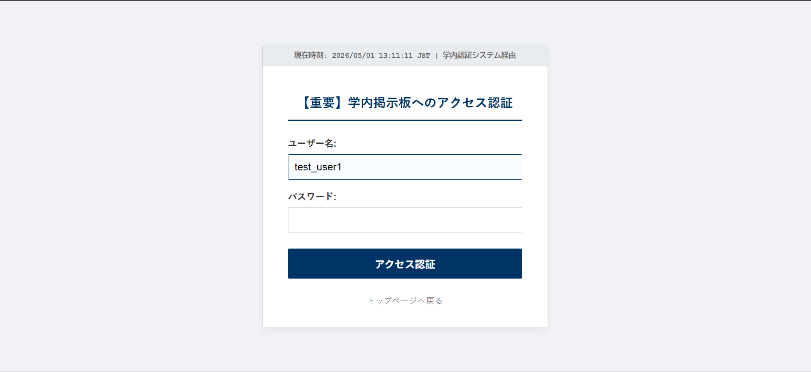
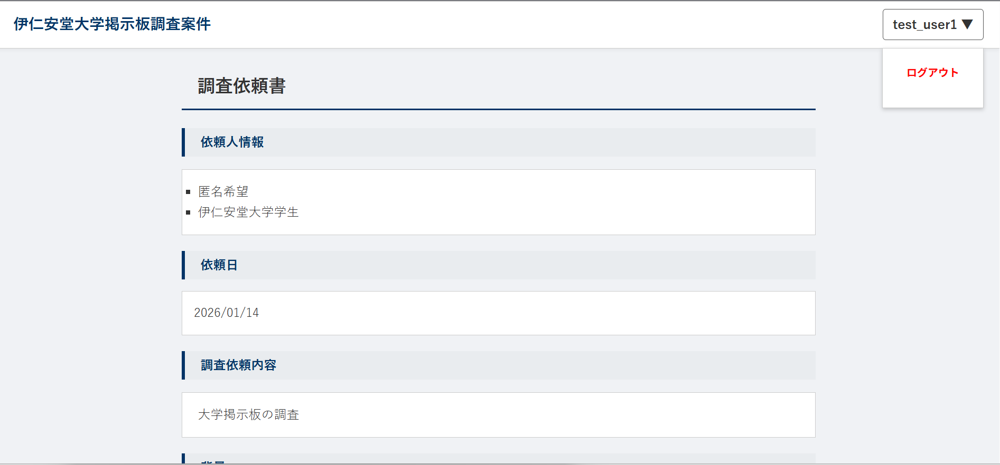
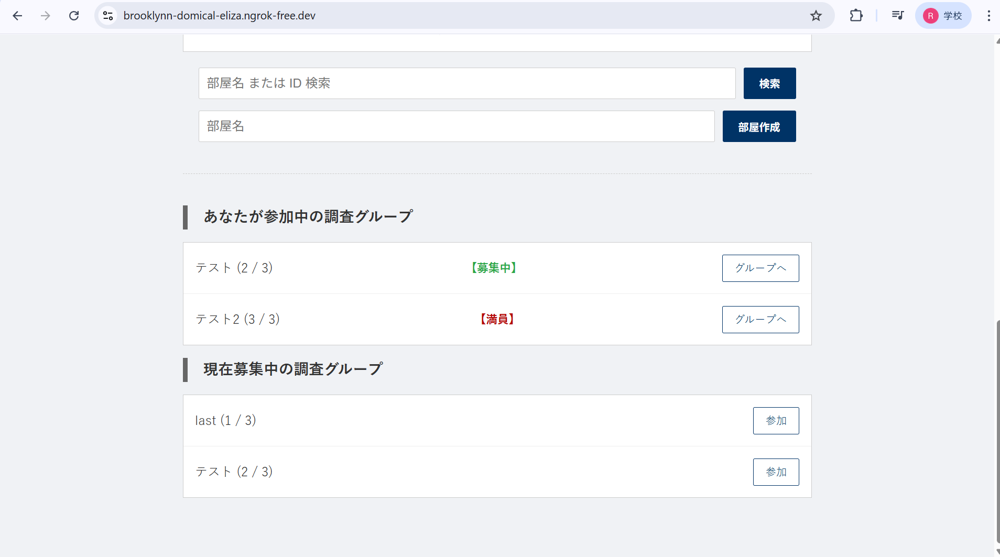
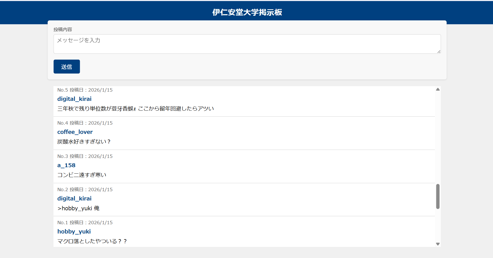
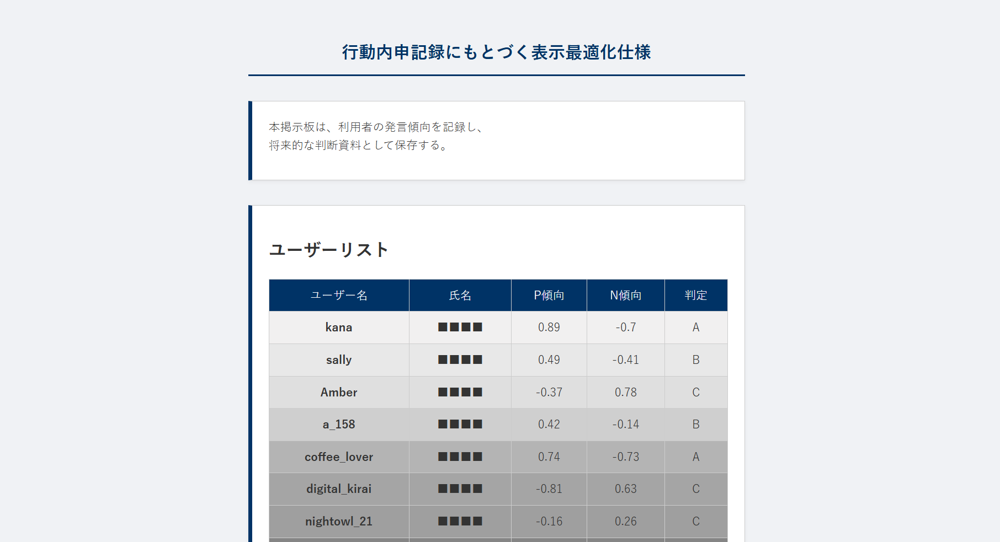
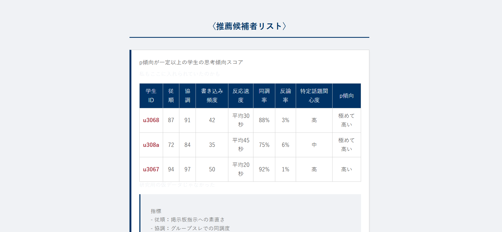
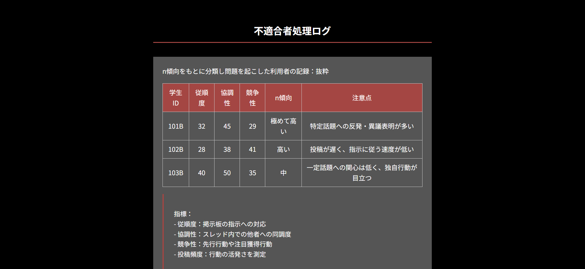
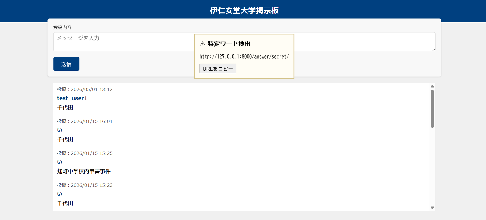
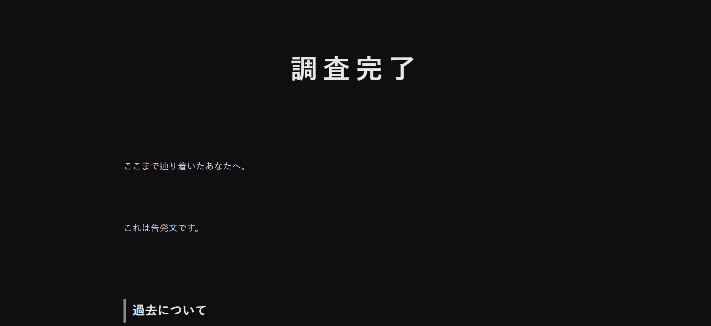

# 大学掲示板型ARG（協力型謎解きWebアプリ）
3人協力型のオンラインARG（Alternate Reality Game）です。  
大学の「学内限定掲示板」という世界観の中で、プレイヤーは同時に同じ掲示板へ参加し、会話・投稿・情報共有を通じて隠された真相にたどり着きます。Discordなどでボイスチャットを併用することも、この掲示板上でリアルタイムに会話することもでき、非対面での3人同時プレイを想定しています。

一見すると普通の雑談掲示板ですが、実際には

- 発言傾向
- 同調性
- 思考傾向
- 行動ログ

をもとに利用者を選別するシステムが裏で動いている、という設定になっています。

プレイヤーは最初のページでアカウント登録/ログインをし、グループを作るかグループ名/IDで検索し、参加したいチームを探せます。

各プレイヤーには

- A：評価・推薦側の情報
- B：排除・不適合者側の情報
- C：システム管理仕様側の情報

がそれぞれ異なる形で提示され、共通している投稿と自分しか見られない投稿があることに気づくことで、情報の共有を促し、3人で情報を統合して初めて真実が分かる構造にしました。

また、特定ワードの送信や隠し条件の達成によって

- 誰か一人にしか表示されない裏ページ（a.html / b.html / c.html）
- 最終ページ（lastpage.html）

が段階的に解放される仕組みを実装しました。

最終的には  
「麹町中学校内申書事件」をモチーフにしたテーマへ接続される構成です。

---

## 使用技術

### バックエンド

- Python3
- Django
- Django Channels（WebSocket）
- Daphne
- Redis

### フロントエンド

- HTML
- CSS
- JavaScript

### データベース

- PostgreSQL

### インフラ/デプロイ

- Render（Web Service / PostgreSQL / Redis）
- WhiteNoise（静的ファイル配信）
- Git / GitHub

### その他

- localStorage（裏ページ解放状態の保存）
- WebSocket によるリアルタイム掲示板更新
- ASGIサーバーとしてDaphneを利用

---

## 動作環境

### ローカル開発環境

- OS：Ubuntu (Linux)
- Python：3.11以上（推奨）
- Django：5.17
- PostgreSQL
- Django Channels
- Render（デプロイ環境）

※ 開発・動作確認はUbuntu環境で行っています。
※ 本番環境は Render 上で運用しています。
※ Windows環境での動作確認は未実施です。

## 実行方法

### 1. リポジトリをクローン
git clone https://github.com/s1f102402518/iniando-arg.git
cd iniando-arg

### 2. 仮想環境を作成
python -m venv venv
source venv/bin/activate

### 3. 必要パッケージをインストール
pip install -r requirements.txt

### 4. 環境変数を設定
.env を作成し、以下を設定

SECRET_KEY=<your_secret_key>
DB_NAME=<your_db_name>
DB_USER=<your_db_user>
DB_PASSWORD=<your_db_password>
DB_HOST=localhost
DB_PORT=5432

### 5. Redis 起動（別ターミナル）
redis-server

### 6. マイグレーション
python manage.py migrate

### 7. サーバー起動
python manage.py runserver

### 8. アクセス
http://127.0.0.1:8000/

### デプロイ（Render）
daphne -b 0.0.0.0 -p $PORT config.asgi:application

必要な環境変数：
SECRET_KEY=<your-django-secret-key>
DEBUG=False
DATABASE_URL=postgresql://<username>:<password>@<host>/<database>
REDIS_URL=redis://<host>:6379
ALLOWED_HOSTS=.onrender.com
CSRF_TRUSTED_ORIGINS=https://<your-app>.onrender.com

複数ユーザーでの挙動確認のため、
別ブラウザ、シークレットモード、別Googleアカウントなどを利用して複数ログインを行うことで、同一パソコン上でもUSER_ORDERごとの表示差分を確認できます。

---

## システム構成図
┌──────────────────────────────┐
│          Browser             │
│ HTML / CSS / JavaScript      │
│ WebSocket / localStorage     │
└─────────────┬────────────────┘
              │
              │ HTTP / WebSocket
              ▼
┌────────────────────────────────────┐
│ Django + Channels + Daphne         │
│                                    │
│ App                                │
│ ├ views.py                         │
│ ├ consumers.py                     │
│ ├ routing.py                       │
│ └ puzzle progression               │
│                                    │
│ accounts / authtest                │
│ └ login / signup / authentication  │
│                                    │
│ config                             │
│ ├ settings.py                      │
│ └ production.py                    │
└───────┬──────────────┬─────────────┘
        │              │
        │              │
        ▼              ▼
┌──────────────┐   ┌──────────────┐
│ PostgreSQL   │   │ Redis        │
│ (Production) │   │ ChannelLayer │
│              │   │ WebSocket    │
│ Room         │   │ Pub/Sub      │
│ Entry        │   │              │
│ Message      │   │              │
└──────────────┘   └──────────────┘

        ▼
┌──────────────┐
│ SQLite       │
│ (Local Dev)  │
└──────────────┘

        ▼
┌──────────────────────────────┐
│ Render                       │
│ Web Service                  │
│ PostgreSQL                   │
│ Redis                        │
│ WhiteNoise                   │
│ render.yaml / Procfile       │
└──────────────────────────────┘
---

## ER図

┌────────────┐
│   Room     │
├────────────┤
│ id         │
│ name       │
│ created_at │
└─────┬──────┘
      │ 1
      │
      ├──────────────┐
      │              │
      │ N            │ N
      ▼              ▼

┌────────────┐   ┌────────────┐
│   Entry    │   │  Message   │
├────────────┤   ├────────────┤
│ id         │   │ id         │
│ nickname   │   │ username   │
│ room_id FK │   │ content    │
└────────────┘   │ timestamp  │
                 │ room_id FK │
                 └────────────┘

---

## 工夫した点
1. 同じ画面なのに見えている情報が違うという体験

全員が同じURL・同じ掲示板を見ているように見せつつ、
window.USER_ORDER
を利用して

表示される文章
hint
裏ページへの導線
URL出現条件

をユーザーごとに変化させました。

これにより、「自分には見えていない情報が他人には見えている」というARGらしい違和感を演出しました。

2. WebSocketを用いたリアルタイム進行

通常の掲示板ではなく、投稿が即時反映される、NPCの投稿が流れる、特定ワード検出でイベント開始

等の工夫をし、よりリアルな謎解き体験に近づけるようにしました。

3. 実在事件との接続

最終的に「麹町中学校内申書事件」へ到達する設計にし、フィクションの大学掲示板の問題が現実社会の評価・選別・記録の問題へ繋がる構成にしました。

エンタメ性だけでなく、テーマ性のあるARGを目指しました。

## 実際の画面

### ログイン画面

### メイン画面

### 通常の掲示板画面

### 裏ページ（A/B/C）

### 最終ワード入力時

### 最終ページ

## 技術選定理由
### Django を採用した理由
- 認証機能（ログイン / サインアップ）が標準で利用できる
- 管理画面が標準搭載されている
- チーム開発で構造が分かりやすい
- PostgreSQL との接続が容易

短期間で安定したWebアプリを構築しやすいため採用しました。

### Django Channels を採用した理由

この作品では
- リアルタイム掲示板
- 投稿の即時反映
- NPCメッセージの進行
- 特定ワードによるイベント出現

が重要だったため、通常の request/response ではなく
WebSocket が必要でした。

Django の既存構成を維持したまま導入できるためChannels を採用しました。

### Redis を採用した理由

Channels の Channel Layer として必要なため採用しました。

### Render を採用した理由

PostgreSQL, Redis, Django本体を無料でまとめて管理できるため採用しました。

## 自分の担当範囲

### 企画・設計

- ARG全体のストーリー設計
- 謎解き導線の設計
- 3人協力型の情報分散構造の設計
- A / B / C それぞれに異なる情報を見せる仕組みの設計
- 最終的に「麹町中学校内申書事件」へ接続する構成の設計

### バックエンド（主担当）

- Django Channels + WebSocket の導入
- views.py の一部機能実装
- 掲示板のリアルタイム更新機能
- USER_ORDER の割り当て処理
- プレイヤーごとの表示分岐ロジック
- 特定ワード検出処理
- 隠しメッセージ出現処理
- NPC投稿の段階表示
- 裏ページ（a.html / b.html / c.html）の解放条件実装
- 最終ページへの導線設計
- localStorageを用いた進行状態保存
- URL出現条件の制御

---

### フロントエンド

- HTML実装（複数ページ）
- JavaScript による進行制御
- 投稿機能の改良
- 特定ワード検出時のアラート機能の改良
- 一部CSS実装・調整

---

### インフラ・デプロイ
- PostgreSQL接続設定
- Render本番環境構築
- Redis接続設定
- production.py作成
- render.yaml作成
- Procfile作成
* WhiteNoise導入
* .env管理
* requirements.txt整理
* デプロイ対応

### 保守・改善

- リファクタリング
- README 作成
- 公開用リポジトリ整備